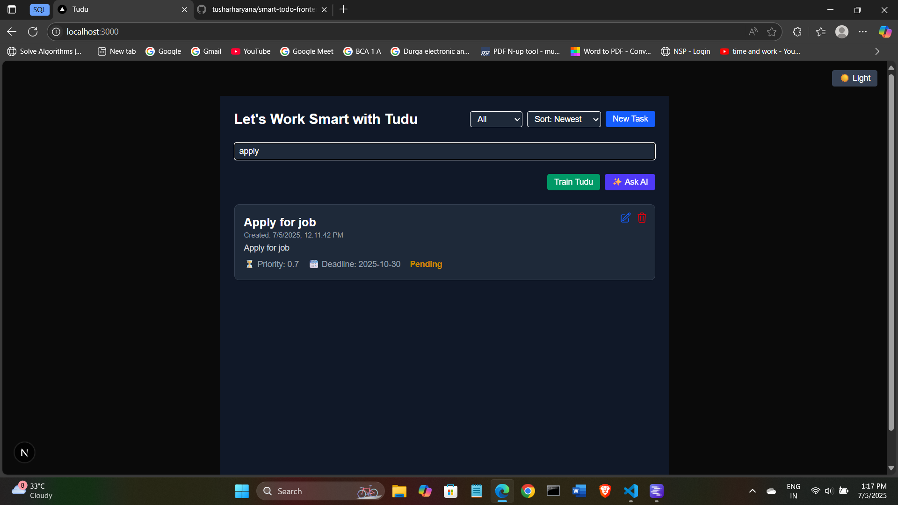
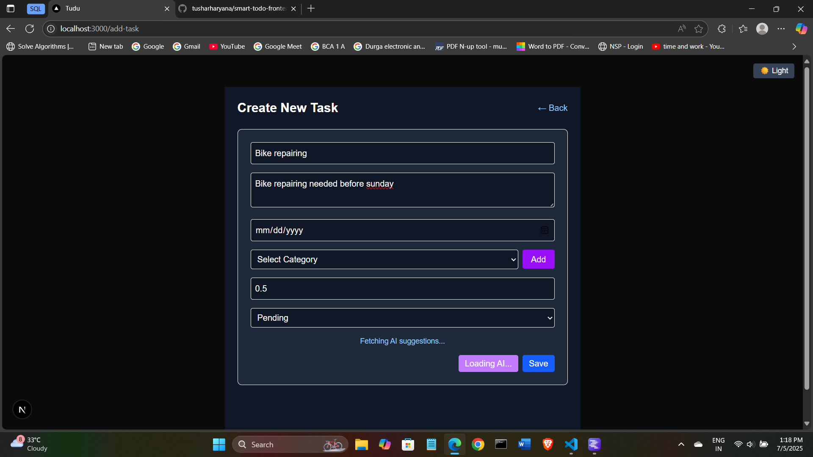
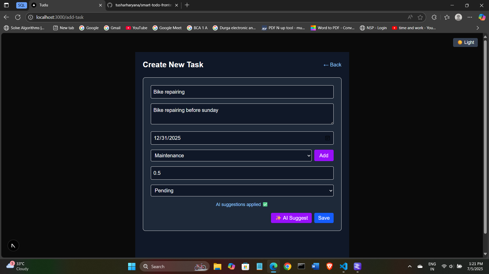
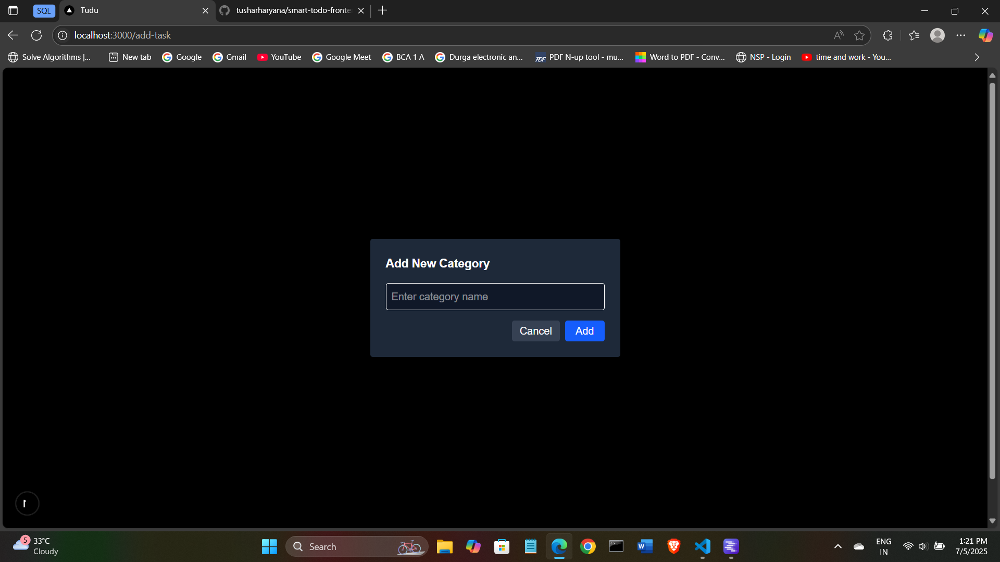
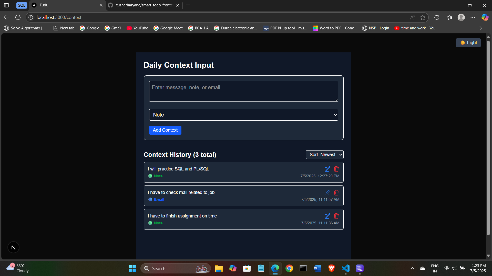

# 🧠 Tudu – Smart Todo Frontend

A modern, AI-powered task management web app built with **Next.js**, **TypeScript**, and **Tailwind CSS**. Features include smart AI suggestions, deadline prioritization, editable tasks, dark/light theme toggle, and contextual task training.

---

## 🚀 Features

- 📋 Create, edit, delete tasks
- 🧠 AI-powered task suggestions using context
- ⏰ Priority & deadline-based sorting
- 🧪 Context training system (Train Tudu)
- 💬 AI recommendation for what to do first
- 📅 Task creation time display
- 🔍 Task filtering and search
- 🗂️ Task categorization (with dynamic add option)

---

## 🛠️ Tech Stack

- **Framework:** Next.js 14 with App Router
- **Language:** TypeScript
- **Styling:** Tailwind CSS
- **API Communication:** Axios
- **Icons:** Heroicons
- **Backend:** Django REST API (see backend folder)

---

## 📦 Installation & Setup

1. **Clone the repository:**
   ```bash
   git clone https://github.com/tusharharyana/smart-todo-frontend.git
   cd smart-todo-frontend
2. **Install packages:**
   ```bash
   npm install
3. **⚙️ Configuration:**
- Edit /lib/axios.ts to match your backend API URL:
    ```bash
    const api = axios.create({
  baseURL: "http://localhost:8000/api/",
    });
    ```
4. **Development**
    ```bash
    npm run dev
## UI Screenshots

- Fiters [Status, Priority, Search]


- Search filter



- AI Suggest on create new task





- Manually add new categeory



- Train Tudu [Daily context input]




- Ask AI


